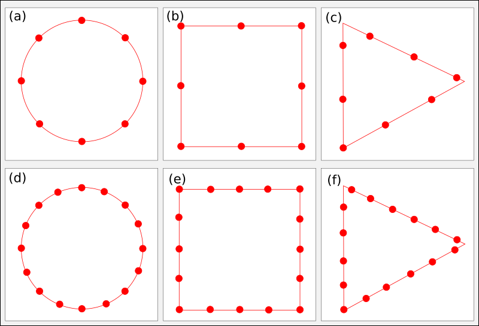
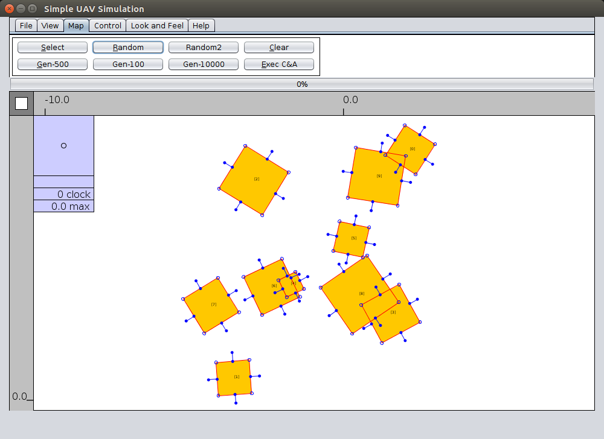
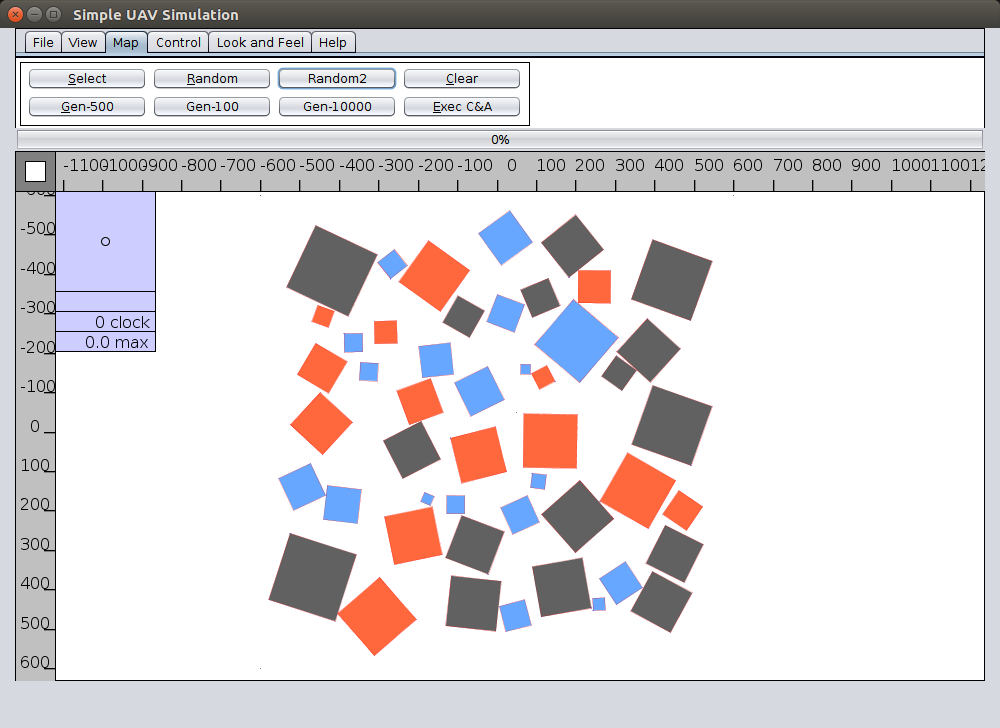

# Create Map Artificial
 
Esse projeto auxilia a criar automaticamente um conjunto de instâncias de mapas artificias. Os arquivos de mapas suportados funcionam tanto no formato dos planejadores quanto dos replanejadores utilizados.

Este projeto foi desenvolvido em Java usando o IDE [Geany](https://www.geany.org/). 

## Como Executar

Para executar esse programa digite no terminal: 

```
java -jar dist/CreateMapArtificial.jar
```

## Interface do Programa

Abaixo encontra-se duas figuras contendo a interface gráfica do programa.



| Arquivo de Mapa do Planejador | Arquivo de Mapa Replanejador  |
|-------------------------------|-------------------------------|
|       |        |

## Arquivos de Saída

Abaixo encontra-se um arquivo de saída de uma possível instância, chamada de temp.sgl.

```
<number of polygons>
10
<x..., y..., n = 4, id = 0>
-0.25,-0.38,0.61,0.74
-7.71,-6.71,-6.57,-7.57
<x..., y..., n = 4, id = 1>
2.43,1.48,2.1,3.05
-5.85,-5.23,-4.28,-4.9
<x..., y..., n = 4, id = 2>
1.97,1.84,0.46,0.59
-1.61,-2.99,-2.86,-1.48
<x..., y..., n = 4, id = 3>
-4.27,-4.35,-3.28,-3.2
-0.66,0.4,0.48,-0.58
<x..., y..., n = 4, id = 4>
1.47,1.12,-0.85,-0.5
-1.73,-3.71,-3.37,-1.38
<x..., y..., n = 4, id = 5>
-4.63,-5.82,-5.09,-3.91
-9.38,-8.66,-7.48,-8.2
<x..., y..., n = 4, id = 6>
-3.99,-4.24,-2.06,-1.8
-2.49,-0.3,-0.05,-2.23
<x..., y..., n = 4, id = 7>
2.99,1.46,1.18,2.7
-4.7,-4.98,-3.46,-3.17
<x..., y..., n = 4, id = 8>
4.45,2.5,3.04,4.99
-3.14,-2.6,-0.66,-1.19
<x..., y..., n = 4, id = 9>
0.82,-0.19,0.39,1.41
-3.37,-2.78,-1.76,-2.35
```

Esse sistema dá suporte a gerar automaticemente um conjunto de instâncias, ao invés de apenas uma.
